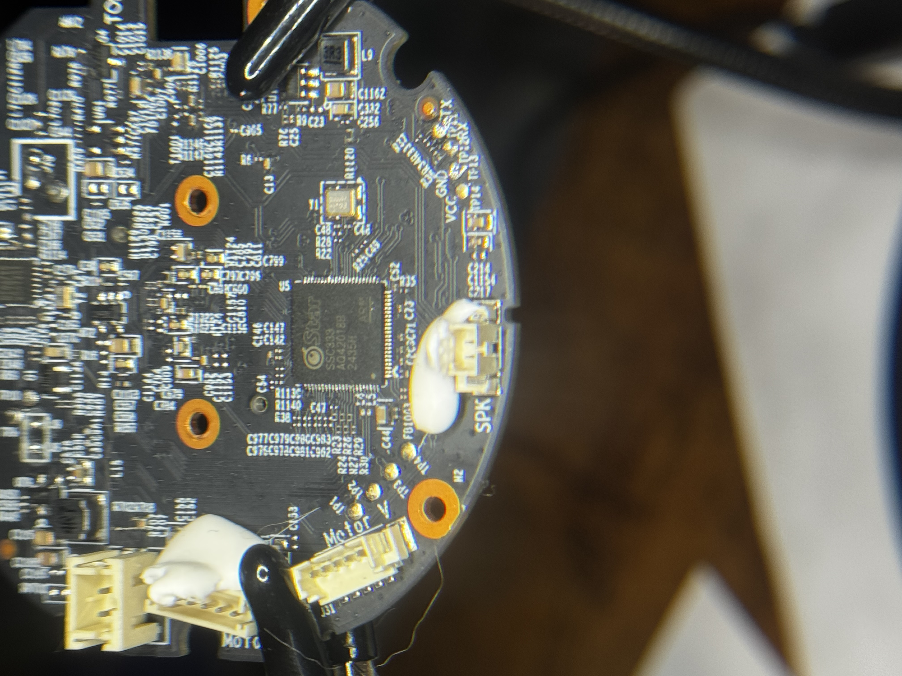
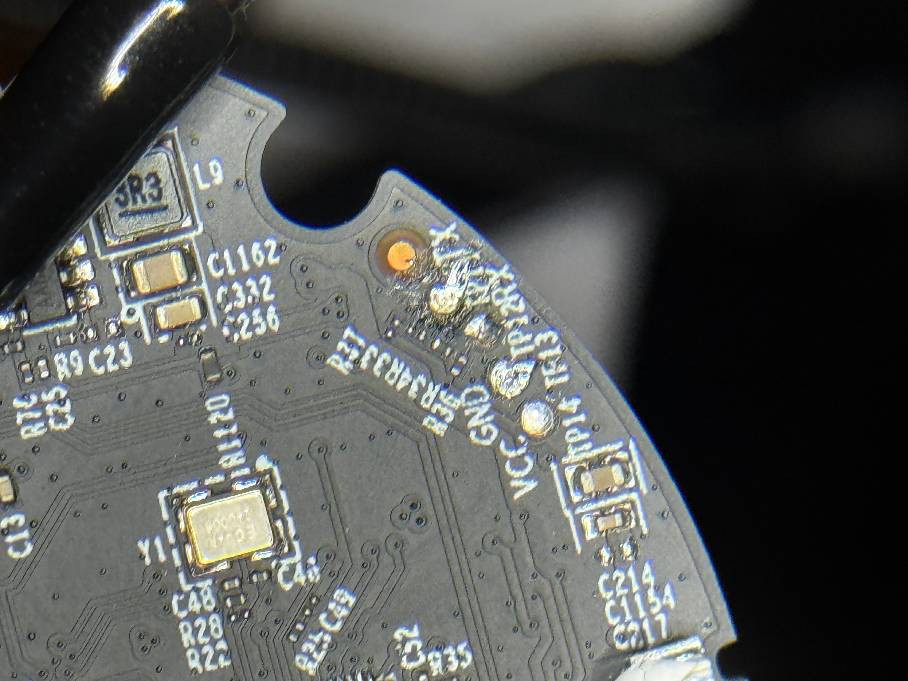
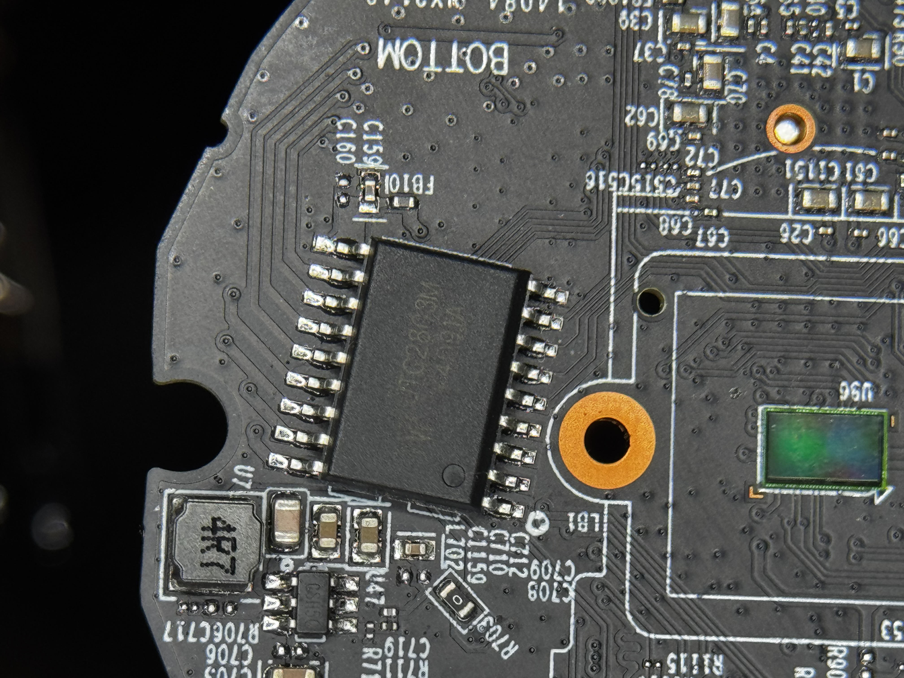
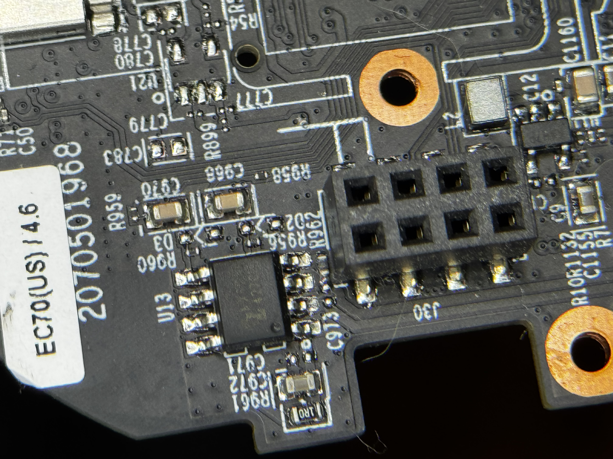

# Identifying components on the PCB

## Front of PCB

### [SigmaStar SSC333: High-Integrated SoC Processor](https://linux-chenxing.org/infinity6/ssc333_pb_v01.pdf)

This is the main chip that interfaces with all of the camera's peripherals.
- Camera Module
- Pan-Tilt-Zoom Stepper Motors
- Microphone and Speaker
- Temperature and Light Sensors 
- System Clock
- WiFi Module
- SD Card
- Serial Connection for SPI Flash Controller

### UART Interface

This is the PCB's UART Interface with nicely labeled TX, RX, GND, and VCC pads. We can solder wires to these pads and connect it to a UART to USB device to view the output generated by the serial console which can contain a lot of useful information.

## Back of PCB

### [YW UTC2803M]()

This is an 8-Channel Darlington Transistor Array used to drive loads that the SoC cannot drive directly. Most likely used for LEDs and the Pan-Tilt-Zoom stepper motor.

### [XMC 25QH64](https://www.xmcwh.com/uploads/442/XM25QH64C.pdf)

This is the device's flash memory that communicates over SPI and has 8MB storage. Will most likely contain, at least, a portion of the device's firmware, if not all of it.

### [MX6208](https://www.lcsc.com/datasheet/C155448.pdf)

This chip is responsible for driving the DC motor for the Pan-Tilt-Zoom functionality.