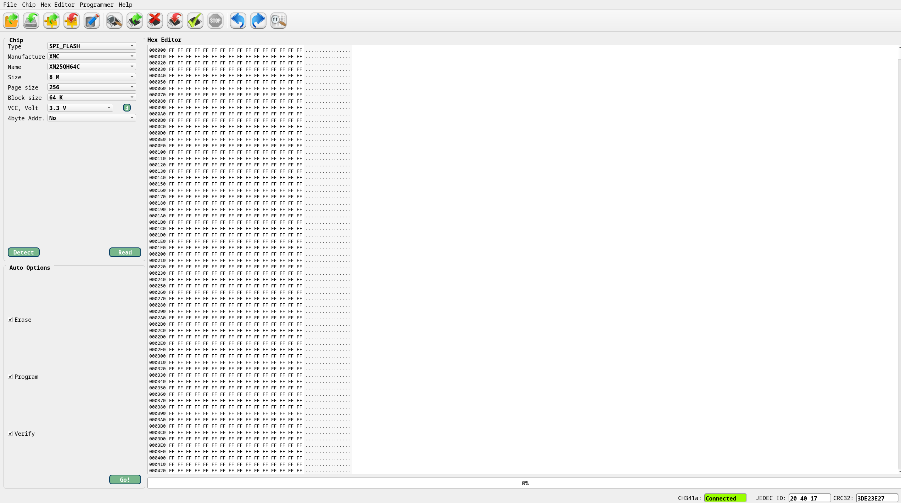

# Firmware Extraction

Using a CH341A programmer we will be able to attach it to the XMC firmware chip located on the back of the PCB to extract the firmware flashed onto the storage.

Since the XMC chip is a 25QH64 flash chip we will attach it to the 25xx option specifically for SPI connections. When attaching the probe clip to the chip we must also ensure proper orientation where the red wire must correspond with the first pin which is located on the corner of the corresponding dot.

After plugging in the Flash Programmer into my Linux machine using a USB extender we can use IMSProg to dump connect to the flash memory over SPI and dump the firmware.

After verification that the chip is detected by the software we can read the contents of the chip and save it to a file.